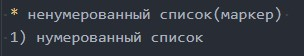
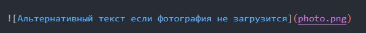
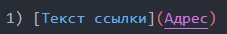
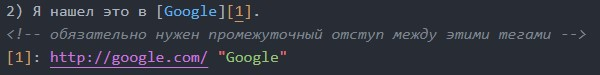
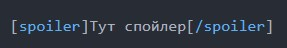
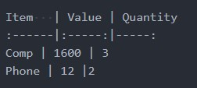
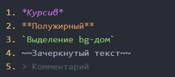
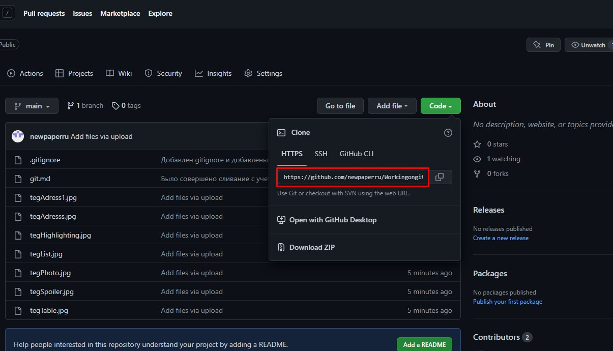

# Инструкция для работы с Markdown

## Списки
 Есть два типа списков, которые используются в языке разметки Markdown:

 * ненумерованный список(маркер) 
 1) нумерованный список

 Команды:   
 
## Изображения
В Markdown можно использовать особый тег, с помощью которого можно использовать изображения

Команда:  
  
**Вызов команды:** ! 
**Альтернативный текст:** [] 
**Путь до картинки:** ()
## Ссылки
В Markdown используется два варианта оформления ссылок:

1) [Текст ссылки](Адрес)
2) Я нашел это в [Google][1].
<!-- обязательно нужен промежуточный отступ между этими тегами -->
[1]: http://google.com/ "Google"
 
  Где 1 - обычная вставка, 
а 2 - оформление ссылки в виде сноски, где можно использоваться в одном коде множество ссылок на разные источники.

Команды:  
#### Для 1:  
  
**Альтернативный текст:** []  
**Ссылка на указанный сайт:** () 

#### Для 2:  

**Слово или словосочетание или текст, которые будут ссылкой:** []  
**переменная(это может быть цифра, слово):** []   
`Данные теги можно вставлять где-угодно, перед или после основого текста или между чем-либо.`

**ВНИМАНИЕ! ПОСЛЕ ПРОПИСКИ ДАННЫХ ТЕГОВ ВНУТРИ ОСНОВОГО ТЕКСТА, НУЖНО СДЕЛАТЬ ОТСТУП МЕЖДУ ТЕКСТОМ И ТЕМ, О ЧЕМ РАССКАЖУ ДАЛЕЕ.**

**После того, как вы написали текст и вставили туда два тега `и сделали один отступ(см. выше)`, нужно указать ссылку, куда ведет этот текст.**

[]: - в него вписываете переменную, которую Вы указали ранее. 
Потом вводите ссылку, сделав пробел перед этим  
И по желанию в "" написать комментарий, к чему он относится.

## Спойлер
В языке разметки Markdown присутствуют спойлеры:

[spoiler]Тут спойлер[/spoiler]

`Внимание! Работает не везде!`

Команда:  

## Таблицы
В языке разметки так же присутствует таблица:

В языке разметки так же присутствует таблица:

Item   | Value | Quantity
:------|:-----:|-----:
Comp | 1600 | 3
Phone | 12 |2

Команда:  

## Выделения 

Есть различные виды выделений, используемых в языки разметки Markdown. Приведу пример 5-х таких видов: 

1. *Курсив*
2. **Полужирный**
3. `Выделение bg-дом`
4. ~~Зачеркнутый текст~~
5. > Комментарий

Команды:  

## git clone

Данная команда прописывается в **терминале**. 
Используется для того, чтобы скачать на свой компьютер с другого репозитория или своего файлы, которые были выложены на GitHub.

Команда: 
git clone адрес

**P.S**
Ссылку на репозиторий можно найти следующим образом(см.картинку) 

## git push
Данная команда прописывается в **терминале**.  
Используется для того, чтобы отправить файлы с Вашего компьютера на Ваш репозиторий, который до этого был __привязан и создан__. 

`Внимание! Для того, чтобы все отправилось на Ваш репозиторий на GitHub, нужно "Подружить" Ваш локальный репозиторий с репозиторием на GitHub. (см. пункт знакомство с GitHub)`