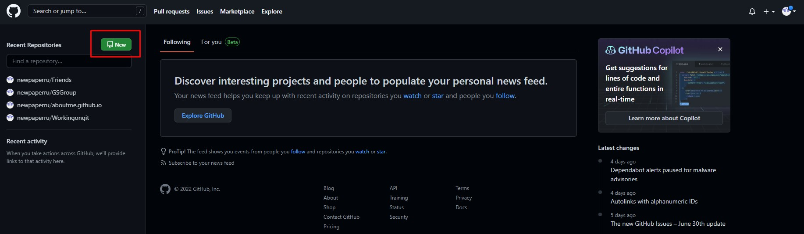
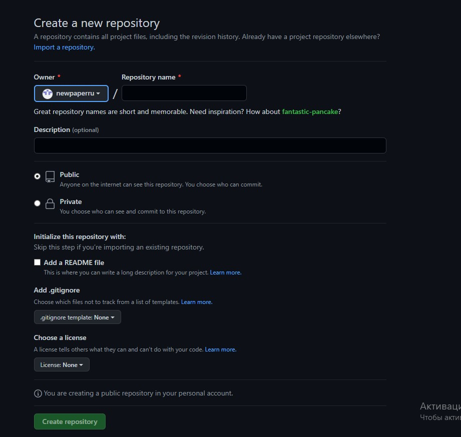
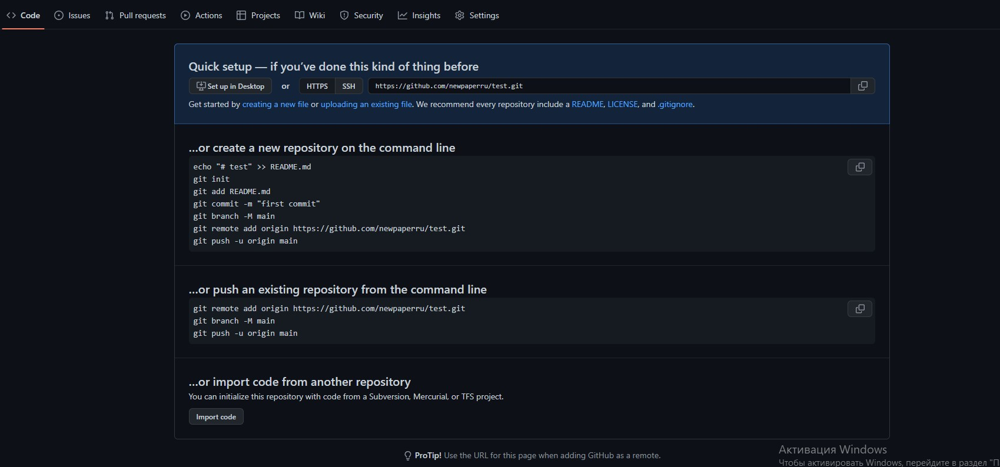

# Инструкция для работы с Markdown

## Списки
 Есть два типа списков, которые используются в языке разметки Markdown:

 * ненумерованный список(маркер) 
 1) нумерованный список

 Команды:   
 
## Изображения
В Markdown можно использовать особый тег, с помощью которого можно использовать изображения

Команда:  
  
**Вызов команды:** ! 
**Альтернативный текст:** [] 
**Путь до картинки:** ()
## Ссылки
В Markdown используется два варианта оформления ссылок:

1) [Текст ссылки](Адрес)
2) Я нашел это в [Google][1].
<!-- обязательно нужен промежуточный отступ между этими тегами -->
[1]: http://google.com/ "Google"
 
  Где 1 - обычная вставка, 
а 2 - оформление ссылки в виде сноски, где можно использоваться в одном коде множество ссылок на разные источники.

Команды:  
#### Для 1:  
  
**Альтернативный текст:** []  
**Ссылка на указанный сайт:** () 

#### Для 2:  

**Слово или словосочетание или текст, которые будут ссылкой:** []  
**переменная(это может быть цифра, слово):** []   
`Данные теги можно вставлять где-угодно, перед или после основого текста или между чем-либо.`

**ВНИМАНИЕ! ПОСЛЕ ПРОПИСКИ ДАННЫХ ТЕГОВ ВНУТРИ ОСНОВОГО ТЕКСТА, НУЖНО СДЕЛАТЬ ОТСТУП МЕЖДУ ТЕКСТОМ И ТЕМ, О ЧЕМ РАССКАЖУ ДАЛЕЕ.**

**После того, как вы написали текст и вставили туда два тега `и сделали один отступ(см. выше)`, нужно указать ссылку, куда ведет этот текст.**

[]: - в него вписываете переменную, которую Вы указали ранее. 
Потом вводите ссылку, сделав пробел перед этим  
И по желанию в "" написать комментарий, к чему он относится.

## Спойлер
В языке разметки Markdown присутствуют спойлеры:

[spoiler]Тут спойлер[/spoiler]

`Внимание! Работает не везде!`

Команда:  

## Таблицы
В языке разметки так же присутствует таблица:

В языке разметки так же присутствует таблица:

Item   | Value | Quantity
:------|:-----:|-----:
Comp | 1600 | 3
Phone | 12 |2

Команда:  

## Выделения 

Есть различные виды выделений, используемых в языки разметки Markdown. Приведу пример 5-х таких видов: 

1. *Курсив*
2. **Полужирный**
3. `Выделение bg-дом`
4. ~~Зачеркнутый текст~~
5. > Комментарий

Команды:  

# Знакомство и работа с GitHub

[GitHub](https://github.com) — это сайт-хранилище для историй версий проектов: вы подключаете Git, регистрируетесь на GitHub, создаёте онлайн-репозиторий и переносите файлы с Git на GitHub.

Для того, чтобы начать работать с **GitHub**, нужно зарегистрироваться там. После регистрации, нужно как-то связать два Ваших репозитория. И вот как это все делается:

## 1 шаг

Для начала нажимаем на свою иконку сверху слева, после чего находим зеленую кнопку "New" и нажимаем на нее (см.картинку) 

После нажатия, у вас откроется страница создания репозитория. Остановимся здесь поподробнее.  

### Repository name

Это название Вашего проекта.

### Description 

Это описание Вашего проекта

### Public / Private
**Public** - делает Ваш репозиторий публичным. То есть, люди смогут просматривать его и клонировать к себе на компьютер

**Private** - делает Ваш репозиторий приватным. То есть, с помощью этого пункта Вы можете ограничить круг лиц, кто может просматривать данный репозиторий.

### Add a README file

Данный файл добавится к вашему репозиторию, где вы сможете указать различные помарки и описание вашего проекта. Подробнее [здесь](https://docs.github.com/en/repositories/managing-your-repositorys-settings-and-features/customizing-your-repository/about-readmes).

### Choose a license

Данный пункт говорит другим пользователям что они могут делать, а что не могут с Вашем кодом. Подробнее [здесь](https://docs.github.com/en/repositories/managing-your-repositorys-settings-and-features/customizing-your-repository/licensing-a-repository)

### Add .gitignore

Добавляет к Вашему проекту специальный файл, с помощью которого можно добавлять игнорируемые файлы. Подробнее [здесь](https://docs.github.com/en/get-started/getting-started-with-git/ignoring-files).

После всех манипуляций, нажимаем `create repository` и следуем к **Шаг 2**

## Шаг 2

После создания репозитория, у вас откроется следующая страница(см.картинку).  

Здесь Вам будет предложено множество вариантов заливки ваших файлов на GitHub, но эта не наша тема на данный момент. Нас интересует "**...or push an existing repository from the command line**".

Копируем все по одному в терминал нашего проекта (о том, как создать терминал, см. [тут](ccskrf))

`Внимание! Сейчас важно понимать! После того, как Вы прописали git push -m origin main, на первый раз у Вас откроется специальное окошко "связки", где Вам нужно будет связать Git с GitHub. Это нужно для того, чтобы только Вы могли вносить изменения на Ваш репозиторий, а не кто-то другое. Иными словами - проверка на то, что это Вы владелец данного репозитория.` 

`Так же, у Вас вместо главной ветки master будет main, будьте внимательными!`

После того, как вы связали Ваш Git с GitHub и все произошло успешно - поздравляю, Вы готовы работать с GitHub! Подробнее о командах некоторых чуть ниже.

## git clone

Данная команда прописывается в **терминале**. 
Используется для того, чтобы скачать на свой компьютер с другого репозитория или своего файлы, которые были выложены на GitHub.

Команда: 
git clone адрес

**P.S**
Ссылку на репозиторий можно найти следующим образом(см.картинку) 

## git push
Данная команда прописывается в **терминале**.  
Используется для того, чтобы отправить файлы с Вашего компьютера на Ваш репозиторий, который до этого был __привязан и создан__. 

`Внимание! Для того, чтобы все отправилось на Ваш репозиторий на GitHub, нужно "Подружить" Ваш локальный репозиторий с репозиторием на GitHub. (см. пункт знакомство с GitHub)`